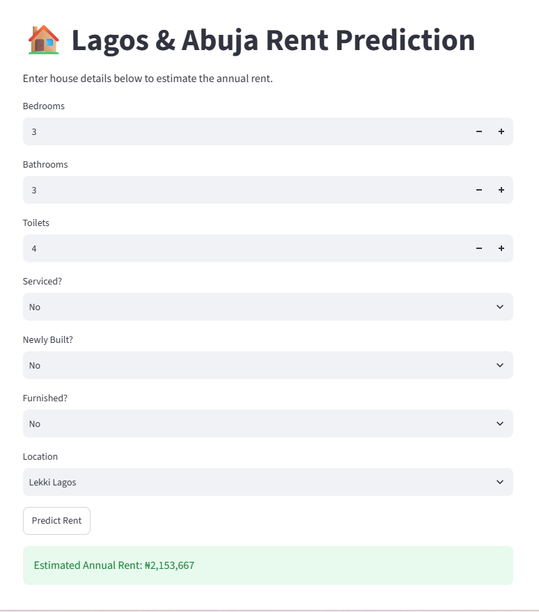

# Lagos/Abuja Rent Prediction 🏠


A Machine Learning project for predicting house rent prices in Lagos and Abuja, Nigeria.

## 📌 Project Overview

Lagos/Abuja Rent Prediction is a Machine Learning project developed as part of the 3MTT capstone project.

The project addresses a common challenge faced by renters in Nigeria: the lack of reliable price benchmarks when searching for rental properties.

The system uses property features such as location, number of bedrooms, bathrooms, toilets, serviced status, newly built status, and furnished status to predict house rent prices.

## 🎯 Problem Statement

Renters in Lagos and Abuja often find it difficult to determine whether a property's asking price is reasonable because rental prices vary significantly depending on location and property features.

The absence of accessible and reliable price benchmarks can make it difficult for renters to make informed housing decisions.

This project aims to provide a data-driven approach for estimating rental prices based on available property characteristics.

## 💡 Project Objective

The main objective of this project is to develop a Machine Learning model capable of predicting house rent prices in Lagos and Abuja based on property characteristics.

The project also provides a simple Streamlit web application through which users can enter property details and receive an estimated rental price.

## 📊 Dataset

The dataset contains 98,080 property listings and 10 columns of original featuers.

The original dataset contains information about property titles, locations, prices, property features, and amenities.

### Main Features

| Feature | Description |

|---|---|

| Title | Property listing title |

| More Info | Additional property information |

| Location | Property location |

| Price | Property rental price |

| Serviced | Indicates whether the property is serviced |

| Newly Built | Indicates whether the property is newly built |

| Furnished | Indicates whether the property is furnished |

| Bedrooms | Number of bedrooms |

| Bathrooms | Number of bathrooms |

| Toilets | Number of toilets |

## 🧹 Data Cleaning

The dataset required cleaning and transformation before it could be used for Machine Learning.

The main preprocessing steps included:
- Converting the `Price` column from text to numeric values.

- Extracting numerical values from `Bedrooms`, `Bathrooms`, and `Toilets`.

- Handling missing values.

- Inspecting duplicate records.

- Examining unusual and extreme price values.

- Preparing categorical features for Machine Learning.

## 🔍 Exploratory Data Analysis

Exploratory Data Analysis was performed to understand the distribution of rental prices and the characteristics of the properties.

The analysis included:

- Descriptive statistics.

- Distribution of rental prices.

- Identification of extreme values and outliers.

- Examination of numerical features.

- Visualization using histograms and boxplots.

## ⚙️ Feature Engineering

The property features were transformed into a format suitable for Machine Learning.

The numerical features included:

- Bedrooms

- Bathrooms

- Toilets

- Serviced

- Newly Built

- Furnished

Location information was also incorporated into the model through feature encoding.

## 🤖 Model Development

The prepared dataset was divided into training and testing sets.

A regression-based Machine Learning approach was used because the target variable, rental price, is a continuous numerical value.

The model was trained using the prepared property features and evaluated on unseen test data.

## 📈 Model Performance

Three regression models were evaluated during the project:

- Linear Regression
- Decision Tree Regressor
- Random Forest Regressor

The **Random Forest Regressor** was selected as the final model.

The model was evaluated on the test dataset using three regression metrics:

| Metric | Result |
|---|---:|
| Mean Absolute Error (MAE) | ₦855,802.30 |
| Root Mean Squared Error (RMSE) | ₦1,224,883.73 |
| R² Score | 0.4691 |

### Interpretation

- **MAE:** On average, the model's predictions differ from the actual rental prices by approximately ₦855,802.
- **RMSE:** The RMSE of approximately ₦1.22 million indicates that larger prediction errors have a stronger influence on the overall error measurement.
- **R² Score:** The model explains approximately 46.9% of the variation in rental prices in the test dataset.

These results provide a baseline for the current version of the rent prediction system.

## ⚠️ Limitations

The current model has some limitations:

- The R² score indicates that a substantial portion of rental-price variation is not explained by the current features.
- Rental prices can be strongly influenced by factors that may not be fully captured in the dataset.
- The dataset contains extreme price values that can affect regression performance.
- Location is an important factor in Nigerian rental prices, and representing location effectively remains a challenge.
- The model should therefore be considered an estimation tool rather than a replacement for actual market valuation.

## 🚀 Future Improvements

Future versions of the project could improve prediction performance by:

- Collecting more recent and geographically detailed rental data.
- Improving location-based feature engineering.
- Investigating additional Machine Learning algorithms.
- Performing systematic hyperparameter tuning.
- Applying additional outlier-handling techniques.
- Adding more property features such as property size, estate information, and proximity to major facilities.
- Continuously retraining the model as new rental-market data becomes available.

## 🖥️ Streamlit Application

A Streamlit web application was developed as the project's MVP.

Users can enter property characteristics such as:

- Location

- Bedrooms

- Bathrooms

- Toilets

- Serviced status

- Newly built status

- Furnished status

The application then uses the trained Machine Learning model to generate an estimated rental price.

### Application Preview



## 📁 Project Structure

```text

Lagos-Abuja-Rent-Prediction/

│

├── app/

│   └── app.py

│

├── models/

│   ├── best\_rent\_prediction\_model.pkl

│   └── feature\_names.pkl

│

├── notebooks/

│   ├── 01\_Project\_Setup.ipynb

│   ├── 02\_Data\_Cleaning.ipynb

│   ├── 03\_Exploratory\_Data\_Analysis.ipynb

│   ├── 04\_Feature\_Engineering.ipynb

│   ├── 05\_Model\_Training.ipynb

│   └── 06 – Model Deployment.ipynb

│

├── .gitignore

├── README.md

└── requirements.txt
```

## 🚀 How To Run The Project

### 1. Clone the repository

```bash

git clone https://github.com/InnoFrank/Lagos-Abuja-Rent-Prediction.git

### 2. Navigate into the project

```bash

cd Lagos-Abuja-Rent-Prediction

### 3. Create the Conda environment

```bash

conda create --name Rent\_Prediction python=3.11

### 4. Activate the environment

```bash

conda activate Rent\_Prediction

### 5. Install the required packages

```bash

pip install -r requirements.txt

### 6. Run the Streamlit application

```bash

streamlit run app/app.py
```

## 🛠️ Technologies Used

- Python

- Pandas

- NumPy

- Scikit-learn

- Matplotlib

- Jupyter Notebook

- Anaconda

- Streamlit

- Git

- GitHub


## 👤 Author

**Nwosu Innocent Mmaduabuchi**

3MTT Learner — Data Science / Machine Learning

### 📫 Contact

- **GitHub:** [InnoFrank](https://github.com/InnoFrank)
- **LinkedIn:** [Innocent Nwosu](https://www.linkedin.com/in/innocent-mmaduabuchi-nwosu-1439b9157)
